# BOCS-IDS

### Evaluating Benign-Only One-Class Scoring for Progressive Network Intrusion Detection Under Domain Shift

---

## Overview

BOCS-IDS is a two-stage machine learning-based intrusion detection framework designed to evaluate benign-only anomaly scoring under progressive cross-dataset conditions.

The framework combines supervised intrusion detection with benign-only novelty scoring using:

- Isolation Forest (IF)
- One-Class SVM (OCSVM)
- Random Forest (RF)

The project evaluates how anomaly-score augmentation behaves under temporal domain shift using:

- CIC-IDS2017 (training dataset)
- CSE-CIC-IDS2018 (testing dataset)

The work specifically investigates transfer stability, anomaly-score collapse, and attack mimicry effects in intrusion detection systems.

---

## Features

- Progressive cross-dataset IDS evaluation
- Benign-only novelty scoring
- Isolation Forest and OCSVM integration
- Random Forest feature selection
- Two-stage IDS framework
- Full ablation study
- Statistical significance testing
- Feature importance analysis
- Confusion matrix visualization
- Performance and timing analysis

---

## Models Used

### Stage-1 Classifiers

- Decision Tree (DT)
- Random Forest (RF)
- Support Vector Machine (SVM)
- Naive Bayes (NB)
- Artificial Neural Network (ANN)
- Deep Neural Network (DNN)

### Stage-2 Novelty Scorers

- Isolation Forest (IF)
- One-Class SVM (OCSVM)

---

## Dataset

### Training Dataset
- CIC-IDS2017

### Testing Dataset
- CSE-CIC-IDS2018

### Preprocessing Steps

- Duplicate removal
- NaN and infinity removal
- Binary label conversion
- Class balancing
- Feature alignment
- Feature normalization

---

## Experimental Workflow

1. Dataset preprocessing
2. Feature selection using Random Forest
3. Stage-1 supervised IDS training
4. Progressive cross-dataset evaluation
5. Benign-only novelty scorer training
6. Novelty-score augmentation
7. Ablation study analysis
8. Statistical significance evaluation

---

## Key Findings

- Continuous anomaly-score augmentation collapses under domain shift.
- Binary anomaly flags provide more transfer-stable improvements.
- Structural attack mimicry causes malicious traffic to resemble benign traffic.
- Progressive dataset evaluation reveals strong generalization degradation.

---

## Repository Structure

```text
BOCS-IDS/
│
├── screenshots/
│   ├── figB1_if_score_distribution.png
│   ├── figB1_score_distributions.png
│   ├── figB2_stage1_vs_bocs.png
│   ├── figB3_bocs_confusion_matrix.png
│   ├── figB4_ablation.png
│   ├── fig09_feature_importance.png
│   ├── fig10_features_vs_accuracy.png
│   ├── fig11_cm_CIC_IDS2017.png
│   ├── fig12_cm_CSE_CIC_IDS2018.png
│   ├── fig13_accuracy_f1.png
│   └── fig14_time.png
│
├── BOCS_IDS_FINAL.ipynb
├── bocs_ids_experiment_v6.py
├── requirements.txt
├── README.md
├── LICENSE
└── .gitignore
```

---

## Installation

Clone the repository:

```bash
git clone https://github.com/varun75405/BOCS-IDS.git
cd BOCS-IDS
```

Install dependencies:

```bash
pip install -r requirements.txt
```

---

## Run the Project

```bash
python bocs_ids_experiment_v6.py
```

Or run the notebook:

```bash
jupyter notebook BOCS_IDS_FINAL.ipynb
```

---

## Technologies Used

- Python
- Scikit-learn
- NumPy
- Pandas
- Matplotlib
- Seaborn
- Jupyter Notebook

---

# Visual Results

## Novelty Score Distribution

### Isolation Forest Novelty Distribution

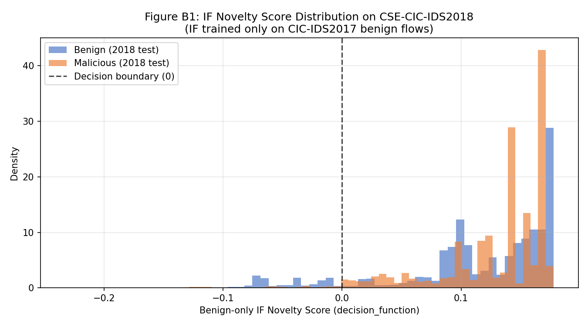

### Isolation Forest vs OCSVM Distribution

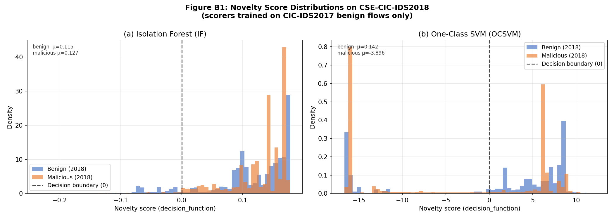

---

## Stage-1 Baselines vs BOCS-RF

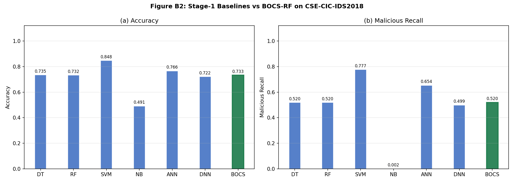

---

## BOCS-RF Confusion Matrix

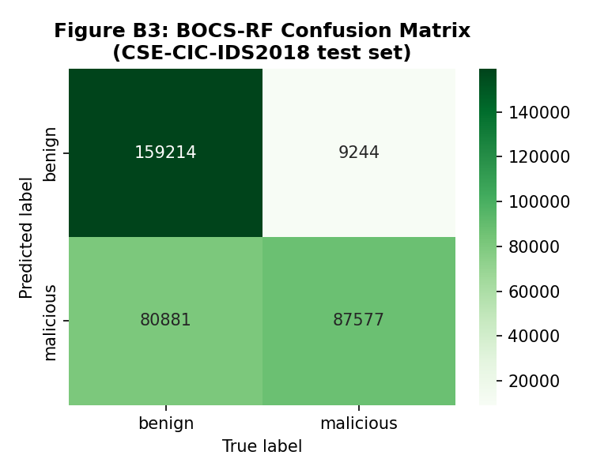

---

## Full Ablation Study

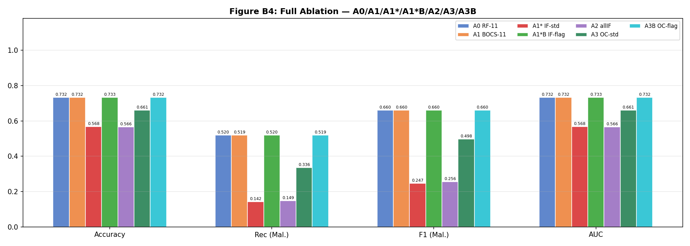

---

## Feature Importance Analysis

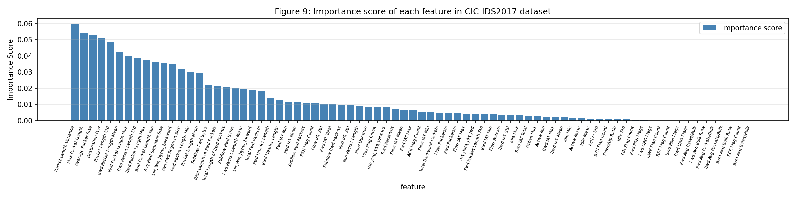

---

## Feature Selection vs Accuracy

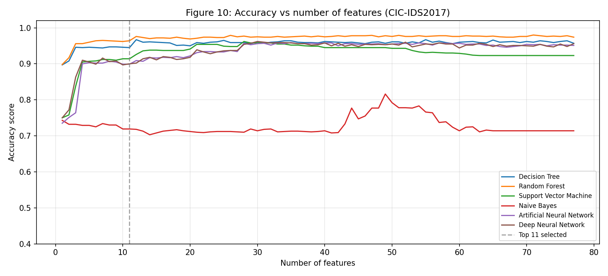

---

## Confusion Matrices on CIC-IDS2017

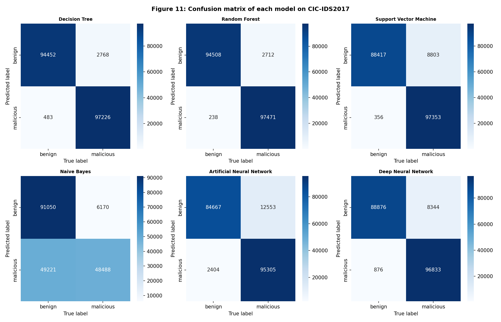

---

## Confusion Matrices on CSE-CIC-IDS2018

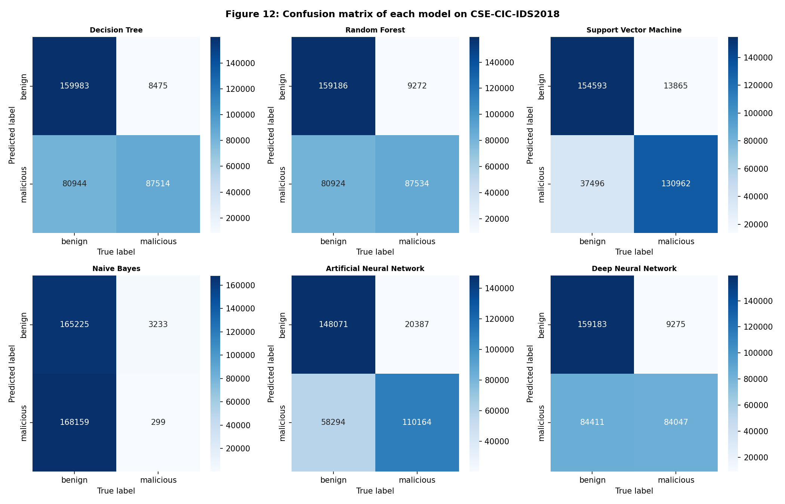

---

## Accuracy and F1-Score Comparison

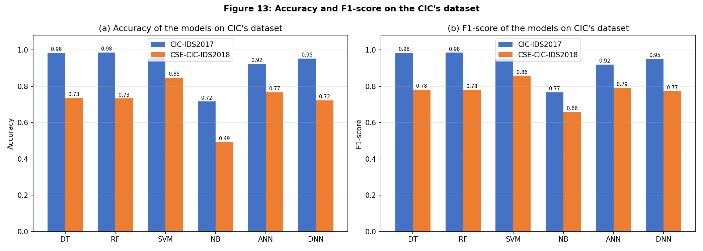

---

## Training and Prediction Time Analysis

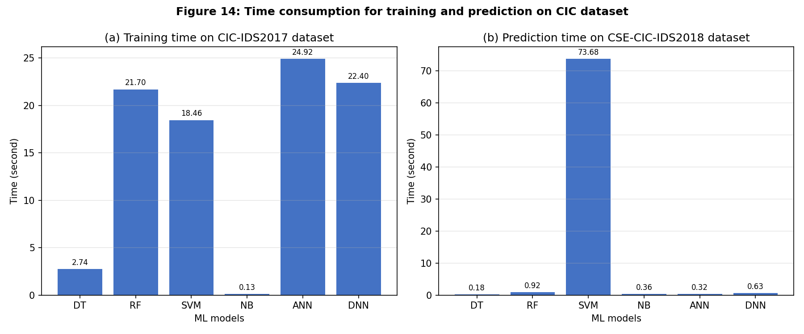

---

## Research Focus

This work investigates:

- Intrusion Detection Systems (IDS)
- Domain shift in cybersecurity datasets
- One-class anomaly detection
- Benign-only learning
- Transfer-stable augmentation
- Cross-dataset generalization
- Attack mimicry effects

---

## References

1. Chua and Salam, *Evaluation of Machine Learning Algorithms in Network-Based Intrusion Detection Using Progressive Dataset*, Symmetry, 2023.

2. Sharafaldin et al., *Toward Generating a New Intrusion Detection Dataset and Intrusion Traffic Characterization*, ICISSP, 2018.

3. Liu et al., *Isolation Forest*, IEEE ICDM, 2008.

4. Schölkopf et al., *Estimating the Support of a High-Dimensional Distribution*, Neural Computation, 2001.

---

## Author

Varun  
B.Tech Computer Science and Engineering  
Cybersecurity and Machine Learning Research
